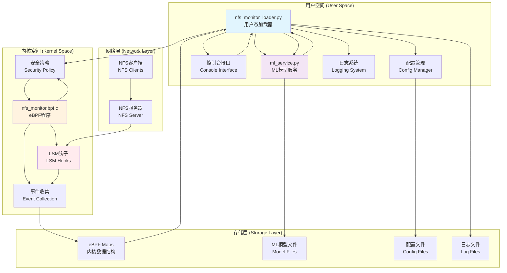
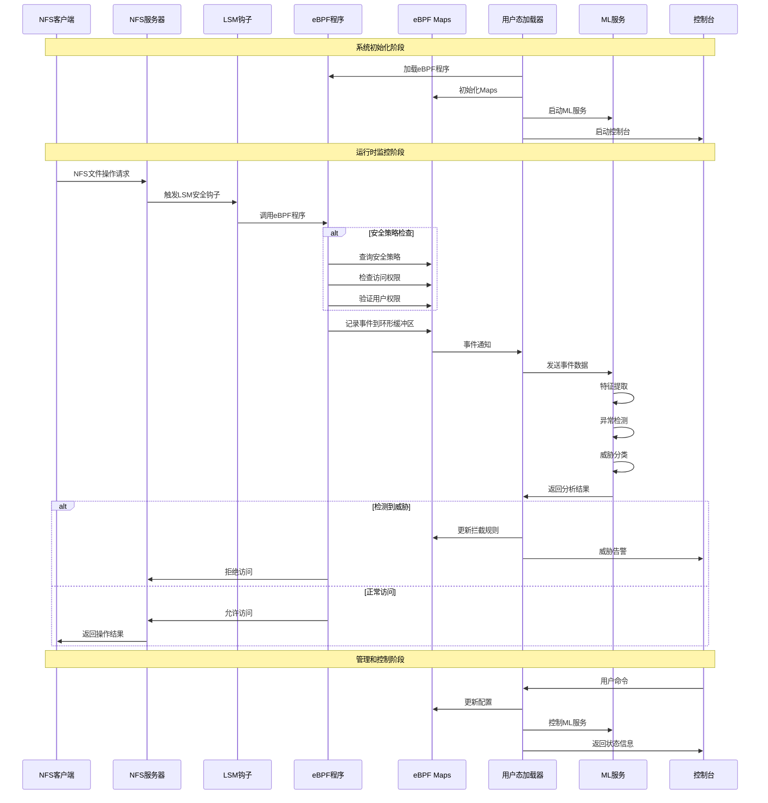

# 过程文档

## 一、比赛题目及分析

### 目标描述：  
  eBPF提供了对Linux内核的增强能力，可以在不改变内核代码的情况下实现对内核功能的扩展，并可以方便的对扩展功能进行卸载而无需重启。网络文件系统（NFS）在服务器端对请求的网络包进行处理后给出对应的相应。结合二者能力可以在内核态就对NFS的部分访问进行处理，而无需到达用户态，从而提高NFS的整体效率。另外结合eBPF的检测能力可以设计实现一个更具安全性的NFS。
  
**本赛题的核心目标是通过 eBPF 技术优化 NFS 网络文件系统的服务性能，并提升其安全性**。

### 设计思路：

#### 1. 核心架构概览:

该项目构建一个基于 eBPF 的高性能安全 NFS 系统，采用三层处理架构：

>数据平面: 
>XDP + TC eBPF 程序处理网络数据包

>控制平面: 
>用户态 NFS 服务处理复杂逻辑

>安全平面: 
>LSM + ML 实现动态安全策略

#### 2.性能优化方案：
- 在 XDP（网卡驱动层）部署 eBPF 程序，捕获 NFS 请求数据包。
- 对于可快速响应的查询请求（如元数据读取），由 XDP 程序直接修改数据包并返回响应，绕过传统内核-用户态交互流程。
- 响应数据由 TC（流量控制层）的 eBPF 程序动态生成，两者通过 eBPF Maps 共享数据，实现协同处理。
  
#### 3.安全性增强方案：
- 在 XDP 层集成过滤规则，对恶意 IP、异常流量（如高频访问）或越权操作（如非法文件访问）直接丢弃数据包。
- 结合 eBPF 的统计能力，使用lsm钩子技术与机器学习大模型分析技术结合的方式，实时分析 NFS 操作行为（如读写比例），动态调整安全策略（如限制特定用户的文件操作范围）。

#### 4. OpenEuler 集成:

### 阶段目标:

#### 阶段 1：基础 NFS 功能 + 简单 eBPF 加速
- 实现基本的XDP 数据包捕获
- 简单元数据查询加速
- 基础性能测试

#### 阶段 2：安全增强
- LSM 集成
- ML 行为分析
- 动态策略调整

#### 阶段 3：生产优化 + 社区集成
- 稳定性增强
- OpenEuler 适配
- 文档完善

## 二、相关资料调研

### 相关资料

- **eBPF**
  - [eBPF 介绍](https://coolshell.cn/articles/22320.html)
  - [Linux eBPF 解析](https://coolshell.cn/articles/22320.html)

- **NFS**
  - [NFS 介绍与使用](https://blog.csdn.net/mushuangpanny/article/details/127097977)
  - [网络文件系统实时性性能改进浅析](https://kns.cnki.net/kcms2/article/abstract?v=uQzRnDzoTXHp2BhjWBKVAVC6t2KvBO-tyYIT30gDdEgG-o_1yLBqT-wNefB4Ozdfn68LNcZQuc_TzNH_kPkg5e5hKEf5JULhnQKWXF8U-aHMib80RLmpvHm55fClCWF0tcTMEOm5K87uZ07bMYCGoLNh32qcI0gxRGBsftrp5iZoq3wJCLQSQ3pwIJLC1kQb&uniplatform=NZKPT&language=CHS)

- **eBPF && XDP**
  - [Linux eBPF 和 XDP 高速处理数据包；使用 EBPF 编写 XDP 网络过滤器；高性能 ACL](https://blog.csdn.net/Rong_Toa/article/details/108993870)
  - [BPF and XDP Reference Guide](https://docs.cilium.io/en/stable/reference-guides/bpf/)
  - [基于 XDP/eBPF 的云网络数据面性能优化研究](https://kns.cnki.net/kcms2/article/abstract?v=uQzRnDzoTXG4vAL7nE3HusvhTTT98SPVDvkfuYoyAh4HEdeLiGAA1p1PXh5x-6_tTQ_04IAH7eUUJw7S-UFMUCec4qY6mhIpRNC--rkjlWR4UplFqegpLhERYACh11fSTbTvMVCRYW6Q-LyXmza_VuqrlLegjoRvucf70rtuTFQOfHjINvdUhYXpZVlpjNsK&uniplatform=NZKPT&language=CHS)

- **LSM**
  - [Linux 安全 - LSM hook点](https://blog.csdn.net/weixin_45030965/article/details/133749748)
  - [Linux平台下基于动态属性的强制访问控制的设计与实现](https://kns.cnki.net/kcms2/article/abstract?v=zgUe5PvusG6KusGbF4ell8gcGU2sqXf-VIql7aglNj-yw9LaE2YiM8Jfu0QmzBRrzhNJk27fbHV54y1cfEQwqeaExpxY6fQcjp7uf5297s53Dox0AT1W4m6MWYa8kekfQgBoMEI2RlXGs9bKrJPCU4f4f5Id-aZV_fXZqI-zBnDlFiG0IPGNqNLR_5bIxQA2&uniplatform=NZKPT&language=CHS)

- **机器学习**
   - [Google Machine Learn](https://developers.google.cn/machine-learning/intro-to-ml?hl=zh-cn)
  

## 三、XDP部分

## 四、LSM+ML部分

### 1. 系统架构

### 2. 工作流程

### 3. 核心组件详细说明

#### 1. eBPF内核程序 (nfs_monitor.bpf.c)

##### 主要功能：
- **LSM钩子集成**：监控 26 个关键 LSM 安全钩子
- **事件收集**：捕获文件操作、权限检查、扩展属性操作等
- **实时拦截**：基于安全策略实时阻止恶意操作
- **数据结构**：维护多个 eBPF Maps 存储策略和统计信息

##### 核心 Maps：
- **events**: 事件环形缓冲区
- **security_policy_map**: 安全策略配置
- **intercept_rules**: 客户端拦截规则
- **file_whitelist**: 文件访问白名单
- **user_permissions**: 用户权限映射
- **sensitive_xattrs**: 敏感扩展属性
- **access_stats**: 访问统计信息

#### 2. ML模型服务 (ml_service.py)

##### 核心算法：
- **异常检测**：Isolation Forest
- **威胁分类**：Random Forest Classifier
- **行为分析**：Gradient Boosting Classifier
- **模式聚类**：DBSCAN

##### 分析维度：
- **LSM钩子专门化**：针对 26 个 LSM 钩子的特征提取
- **多层检测架构**：规则 + 统计 + 行为 + ML 的复合检测
- **威胁分类系统**：6 大类威胁识别
- **客户端行为档案**：动态风险评级

##### 威胁类别：
1. **PRIVILEGE_ESCALATION** - 权限提升
2. **DATA_EXFILTRATION** - 数据泄露
3. **SYSTEM_MANIPULATION** - 系统操控
4. **MALWARE_EXECUTION** - 恶意软件执行
5. **FILE_DESTRUCTION** - 文件破坏
6. **RECONNAISSANCE** - 侦察活动

#### 3. 用户态加载器 (nfs_monitor_loader.py)

##### 核心功能：
- **eBPF程序管理**：加载、配置、监控 eBPF 程序
- **事件处理**：实时处理内核事件
- **ML服务集成**：协调 ML 分析和决策
- **用户控制台**：提供交互式管理界面

##### 控制台命令：
- **stats**: 查看监控统计
- **clients**: 查看活跃客户端
- **threats**: 查看最近威胁
- **policies**: 管理安全策略
- **ml status**: 查看ML服务状态
- **export**: 导出数据
- **help**: 帮助信息

## 五、OpenEuler 适配
