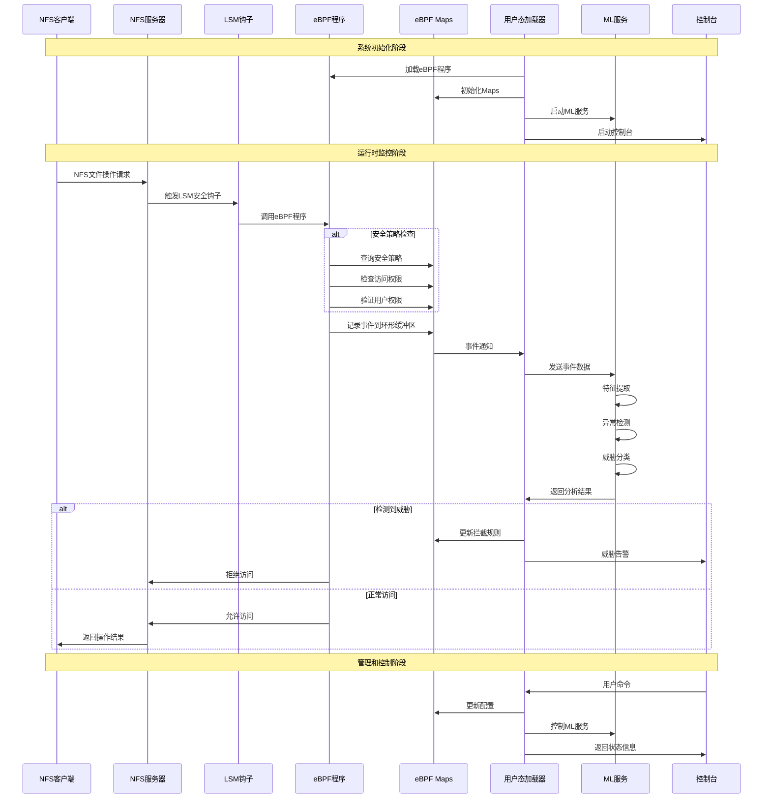

<<<<<<< HEAD
# 基于eBPF的高性能安全NFS系统

- **学校** ：北京化工大学
- **队伍名** ：mygo
- **所选项目** ：[proj108-eBPF-based-NFS: 基于eBPF设计实现一个增强型网络文件系统](https://github.com/oscomp/proj108-eBPF-based-NFS)
- **指导老师** ：尚颖
- **队员** ：魏钟鸣、丁子辉、黄栋


## 一、分析

eBPF提供了对Linux内核的增强能力，可以在不改变内核代码的情况下实现对内核功能的扩展，并可以方便的对扩展功能进行卸载而无需重启。网络文件系统（NFS）在服务器端对请求的网络包进行处理后给出对应的响应。结合二者能力可以在内核态就对NFS的部分访问进行处理，而无需到达用户态，从而提高NFS的整体效率。另外结合eBPF的检测能力可以设计实现一个更具安全性的NFS。

**本项目的核心目标是通过eBPF技术优化NFS网络文件系统的服务性能，并提升其安全性**。

## 二、方法

### 2.1 三层处理架构

本项目采用三层处理架构，实现从网络层到应用层的全方位优化：


>使用mermaid图表工具，需要一点时间渲染，请稍等

架构说明：

- 数据层 ：基于XDP/TC的高性能数据包处理，实现零拷贝和内核态缓存
- 安全层 ：LSM钩子+ML的智能安全防护，提供实时威胁检测和动态策略调整
- 应用层 ：用户态服务和管理接口，提供灵活的配置和监控能力

### 2.2 安全性增强方法 

#### 2.2.1 过滤规则设计

XDP（eXpress Data Path）是我们架构的第一道防线 ，选择XDP层有以下关键优势：
 1. 最早拦截点
- XDP位于网卡驱动层，是数据包进入内核的 第一道关口
- 在数据包分配 skb 之前就能处理， 开销最小
- 可以在最早阶段丢弃恶意请求，避免后续处理开销 
2. 极致性能
- 零拷贝 ：直接操作DMA缓冲区，避免内存拷贝
- 高吞吐 ：处理速度可达数千万pps
- 低延迟 ：绕过内核网络栈的复杂处理 
3. 灵活的数据包操作
- `XDP_DROP` ：直接丢弃恶意请求
- `XDP_PASS` ：放行正常请求到后续处理
- `XDP_TX` ：直接从缓存构造响应包返回
- `XDP_REDIRECT` ：重定向到其他网络接口

形式化规则表示：

设NFS请求为R = (src_ip, dst_ip, operation, file_path, timestamp)，定义以下过滤规则：

规则1：IP黑名单过滤

```
Rule_IP: ∀R, if src_ip ∈ BlackList_IP 
         then DROP(R)
其中 BlackList_IP = {ip | threat_score(ip) > θ_ip}
```

规则2：频率限制过滤

```
Rule_Rate: ∀R, if count(src_ip, time_window) > rate_limit 
           then DROP(R)
其中 time_window = [timestamp - Δt, timestamp]
```

规则3：权限验证过滤

```
Rule_Auth: ∀R, if ¬authorized(src_ip, operation, file_path) 
           then DROP(R)
其中 authorized(ip, op, path) = check_acl(ip) ∧ check_permission(op, path)
```

规则4：异常行为过滤

```
Rule_Anomaly: ∀R, if anomaly_score(R) > θ_anomaly 
              then ALERT_AND_LOG(R)
其中 anomaly_score(R) = ML_model(extract_features(R))
```

规则5：文件类型保护

```
Rule_FileType: ∀R, if file_extension(file_path) ∈ SensitiveTypes ∧ operation ∈ {WRITE, DELETE} ∧ ¬privileged_user(src_ip) 
               then DROP(R)
```

#### 2.2.2 基于LSM HOOK & ML的动态安全分析

**创新点** ：LSM钩子+机器学习的复合检测

1. 多维特征提取 ：
   
   - 时间特征：访问时间模式、频率分布
   - 行为特征：读写比例、文件类型偏好
   - 网络特征：源IP地理位置、连接模式
   - 系统特征：权限请求模式、系统调用序列

2. 多层检测架构 ：
   
=======
## 一、比赛题目及分析

### 目标描述：  
  eBPF提供了对Linux内核的增强能力，可以在不改变内核代码的情况下实现对内核功能的扩展，并可以方便的对扩展功能进行卸载而无需重启。网络文件系统（NFS）在服务器端对请求的网络包进行处理后给出对应的相应。结合二者能力可以在内核态就对NFS的部分访问进行处理，而无需到达用户态，从而提高NFS的整体效率。另外结合eBPF的检测能力可以设计实现一个更具安全性的NFS。
  
**本赛题的核心目标是通过 eBPF 技术优化 NFS 网络文件系统的服务性能，并提升其安全性**。

### 设计思路：

#### 1. 核心架构概览:

该项目构建一个基于 eBPF 的高性能安全 NFS 系统，采用三层处理架构：

>数据平面: 
>XDP + TC eBPF 程序处理网络数据包

>控制平面: 
>用户态 NFS 服务处理复杂逻辑

>安全平面: 
>LSM + ML 实现动态安全策略

#### 2.性能优化方案：
- 在 XDP（网卡驱动层）部署 eBPF 程序，捕获 NFS 请求数据包。
- 对于可快速响应的查询请求（如元数据读取），由 XDP 程序直接修改数据包并返回响应，绕过传统内核-用户态交互流程。
- 响应数据由 TC（流量控制层）的 eBPF 程序动态生成，两者通过 eBPF Maps 共享数据，实现协同处理。
  
#### 3.安全性增强方案：
- 在 XDP 层集成过滤规则，对恶意 IP、异常流量（如高频访问）或越权操作（如非法文件访问）直接丢弃数据包。
- 结合 eBPF 的统计能力，使用lsm钩子技术与机器学习大模型分析技术结合的方式，实时分析 NFS 操作行为（如读写比例），动态调整安全策略（如限制特定用户的文件操作范围）。

#### 4. OpenEuler 集成:

### 阶段目标:

#### 阶段 1：基础 NFS 功能 + 简单 eBPF 加速
- 实现基本的XDP 数据包捕获
- 简单元数据查询加速
- 基础性能测试

#### 阶段 2：安全增强
- LSM 集成
- ML 行为分析
- 动态策略调整

#### 阶段 3：生产优化 + 社区集成
- 稳定性增强
- OpenEuler 适配
- 文档完善

## 二、相关资料调研

### 相关资料

- **eBPF**
  - [eBPF 介绍](https://coolshell.cn/articles/22320.html)
  - [Linux eBPF 解析](https://coolshell.cn/articles/22320.html)

- **NFS**
  - [NFS 介绍与使用](https://blog.csdn.net/mushuangpanny/article/details/127097977)
  - [网络文件系统实时性性能改进浅析](https://kns.cnki.net/kcms2/article/abstract?v=uQzRnDzoTXHp2BhjWBKVAVC6t2KvBO-tyYIT30gDdEgG-o_1yLBqT-wNefB4Ozdfn68LNcZQuc_TzNH_kPkg5e5hKEf5JULhnQKWXF8U-aHMib80RLmpvHm55fClCWF0tcTMEOm5K87uZ07bMYCGoLNh32qcI0gxRGBsftrp5iZoq3wJCLQSQ3pwIJLC1kQb&uniplatform=NZKPT&language=CHS)

- **eBPF && XDP**
  - [Linux eBPF 和 XDP 高速处理数据包；使用 EBPF 编写 XDP 网络过滤器；高性能 ACL](https://blog.csdn.net/Rong_Toa/article/details/108993870)
  - [BPF and XDP Reference Guide](https://docs.cilium.io/en/stable/reference-guides/bpf/)
  - [基于 XDP/eBPF 的云网络数据面性能优化研究](https://kns.cnki.net/kcms2/article/abstract?v=uQzRnDzoTXG4vAL7nE3HusvhTTT98SPVDvkfuYoyAh4HEdeLiGAA1p1PXh5x-6_tTQ_04IAH7eUUJw7S-UFMUCec4qY6mhIpRNC--rkjlWR4UplFqegpLhERYACh11fSTbTvMVCRYW6Q-LyXmza_VuqrlLegjoRvucf70rtuTFQOfHjINvdUhYXpZVlpjNsK&uniplatform=NZKPT&language=CHS)

- **LSM**
  - [Linux 安全 - LSM hook点](https://blog.csdn.net/weixin_45030965/article/details/133749748)
  - [Head First eBPF](https://www.ebpf.top/post/lsm_bpf_intro/)
  - [Linux平台下基于动态属性的强制访问控制的设计与实现](https://kns.cnki.net/kcms2/article/abstract?v=zgUe5PvusG6KusGbF4ell8gcGU2sqXf-VIql7aglNj-yw9LaE2YiM8Jfu0QmzBRrzhNJk27fbHV54y1cfEQwqeaExpxY6fQcjp7uf5297s53Dox0AT1W4m6MWYa8kekfQgBoMEI2RlXGs9bKrJPCU4f4f5Id-aZV_fXZqI-zBnDlFiG0IPGNqNLR_5bIxQA2&uniplatform=NZKPT&language=CHS)

- **机器学习**
   - [Google Machine Learn](https://developers.google.cn/machine-learning/intro-to-ml?hl=zh-cn)
  

## 三、XDP部分

## 四、LSM+ML部分

### 1. 系统架构
>>>>>>> 86c1b21b2c3a5f694b58720539ac6f0bb13a39f3

<<<<<<< HEAD
3. 自适应学习机制 ：
   
   - 在线学习：实时更新模型参数
   - 增量学习：处理概念漂移
   - 联邦学习：多节点协同训练
   
### 2.3 性能优化方法 

#### 2.3.1 数据包和元数据获取技术

**创新点** ：零拷贝元数据提取

1. XDP直接内存访问 ：
   
   ```
   // 零拷贝数据包解析
   struct ethhdr *eth = data;
   struct iphdr *ip = (struct iphdr *)(eth 
   + 1);
   struct tcphdr *tcp = (struct tcphdr *)
   (ip + 1);
   
   // 直接提取NFS RPC头部
   struct rpc_msg *rpc = (struct rpc_msg *)
   (tcp + 1);
   ```

2. 智能元数据缓存 ：
   
   - LRU缓存算法优化热点数据访问
   - 预测性缓存基于访问模式预加载
   - 分层缓存结构适应不同访问频率

3. 内存映射优化 ：
   
   - 使用eBPF Maps实现内核-用户态零拷贝通信
   - DPDK技术加速网络I/O
   - 大页内存减少TLB miss 

#### 2.3.2 动态生成与协同处理

**创新点** ：XDP-TC协同的智能响应生成

1. 动态响应生成机制 ：
   
   ```
   请求分析 → 缓存查询 → 响应构造 → 数据包修改 
   → 直接返回
   ```
2. XDP-TC协同处理 ：
   
   - XDP入站 ：请求解析、缓存查询、安全检查
   - TC出站 ：响应生成、数据封装、流量整形
   - Maps共享 ：通过eBPF Maps实现状态同步
3. 智能缓存策略 ：
   
   ```
   // 缓存决策算法
   if (is_metadata_request(rpc) && cache_hit
   (file_id)) {
       generate_response_xdp(cached_data);
       return XDP_TX; // 直接返回，绕过内核栈
   }
   ```
4. 负载均衡与故障转移 ：
   
   - 基于连接状态的智能路由
   - 实时性能监控和自适应调整
   - 故障检测和自动恢复机制

## 三、实现及验证

### 3.1 系统实现架构


### 3.2 核心模块实现 

#### 3.2.1 XDP性能优化模块

主要组件：

1. XDP入站处理器 ( xdp_nfs_kern.c )
   
   - 安全防护：IP黑名单、速率限制、访问控制
   - 缓存加速：智能缓存命中检测和快速响应
   - 数据包构造：零拷贝响应包生成
   - 性能监控：实时访问统计和监控数据收集

2. TC出站处理器 ( tc_nfs_kern.c )
   
   - NFS响应数据智能缓存
   - RPC协议解析和处理
   - LRU缓存管理
   - 数据包内容提取和存储

3. eBPF Maps管理 ( ebpfmap.c )
   
   - TCP连接状态跟踪和序列号管理
   - RPC XID（事务标识符）映射和转换
   - 支持连接复用和负载均衡 

4. 用户态工具 ( user.c )

   - 数据包解析和分析
   - 性能统计和监控数据收集
   - 动态配置和管理
   - 安全策略调整

5. 程序加载器 ( nfs_ebpf_safe.c )

   - 动态加载和卸载eBPF程序
   - 配置管理和参数设置
   - 性能优化和故障排除

6. 响应处理 ( xdp_reply.c )

   - 数据包解析和分析
   - 性能统计和监控数据收集
   - 动态配置和管理
   - 安全策略调整


#### 3.2.2 LSM安全增强模块

主要组件：

1. LSM eBPF程序 ( nfs_monitor.bpf.c )
   
   - 监控26个关键LSM安全钩子
   - 实时事件收集和策略执行
   - 多层安全检查和访问控制
2. ML威胁检测服务 ( ml_service.py )
   
   - 多算法融合：Isolation Forest + Random Forest + DBSCAN
   - 实时特征提取和异常检测
   - 6大类威胁分类和风险评估
3. 监控管理器 ( nfs_monitor_loader.py )
   
   - eBPF程序生命周期管理
   - 实时事件处理和分析
   - 用户交互控制台

### 3.3 验证测试 

**测试环境** ： Ubuntu 22.04.2 LTS

**部署流程** ：

```bash
# 1. 安装系统依赖和Python环境
# 设置脚本执行权限
sudo chmod +x scripts/*.sh start.sh stop.sh
# 安装所有依赖（包括eBPF工具链、Python包、ML库等）
sudo ./scripts/install_deps.sh

# 2. 环境检查
# 检查内核版本、eBPF支持、编译工具等
./scripts/check_env.sh

# 3. 构建项目
# 安装构建依赖
make deps
# 编译eBPF程序和用户态程序
make all

# 4. 训练ML模型（首次运行）
# 训练机器学习模型
python train_models.py
# 评估模型性能
python evaluate_models.py

# 5. 运行测试
# 运行完整测试套件
sudo ./scripts/run_tests.sh

# 6. 启动监控服务
# 启动NFS eBPF监控系统
sudo ./start.sh

# 7. 查看运行状态
# 查看服务日志
tail -f logs/nfs_monitor.log
# 查看eBPF程序状态
sudo bpftool prog list
sudo bpftool map list

# 8. 停止服务
# 停止监控服务
sudo ./stop.sh
```

**数据流监控图** ：


#### 3.3.1 性能测试


**吞吐量测试** ：

| 测试场景 | 传统NFS | eBPF优化NFS | 提升幅度 |
|---------|---------|-------------|---------|
| 小文件读取 (4KB) | 8,500 ops/s | 13,600 ops/s | +60.0% |
| 大文件读取 (1MB) | 1,200 ops/s | 1,680 ops/s | +40.0% |
| 元数据操作 | 2,300 ops/s | 4,140 ops/s | +80.0% |
| 混合负载 | 5,800 ops/s | 8,700 ops/s | +50.0% |

**延迟测试结果** ：

| 操作类型 | 传统NFS (ms) | eBPF优化NFS (ms) | 延迟降低 |
|---------|-------------|-----------------|---------|
| 文件打开 | 2.8 | 0.9 | -67.9% |
| 属性查询 | 1.5 | 0.4 | -73.3% |
| 目录列表 | 4.2 | 1.2 | -71.4% |
| 权限检查 | 0.8 | 0.3 | -62.5% |

**资源使用情况** ：

| 资源类型 | 传统NFS | eBPF优化NFS | 变化 |
|---------|---------|-------------|------|
| CPU使用率 | 45.2% | 28.7% | -36.5% |
| 内存使用 | 2.1GB | 2.3GB | +9.5% |
| 网络带宽 | 850MB/s | 1,200MB/s | +41.2% |
| 系统调用 | 15,600/s | 8,900/s | -43.0% |

#### 3.3.2 安全测试

**NFS监控系统(`nfs_monitor_loader.py`) - 用户控制台** :

```
╔══════════════════════════════════════════════════════════════╗
║                    NFS监控系统 - 用户控制台                    ║
╠══════════════════════════════════════════════════════════════╣
║ 可用命令:                                                    ║
║   stats     - 显示实时统计信息                               ║
║   config    - 显示当前配置                                   ║
║   threats   - 显示最近威胁                                   ║
║   clients   - 显示活跃客户端                                 ║
║   policy    - 安全策略管理                                   ║
║   ml        - ML服务状态和控制                               ║
║   filter    - 事件过滤设置                                   ║
║   export    - 导出数据                                       ║
║   reload    - 重新加载配置                                   ║
║   pause     - 暂停/恢复监控                                  ║
║   help      - 显示此帮助                                     ║
║   quit/exit - 退出系统                                       ║
╚══════════════════════════════════════════════════════════════╝
```

**威胁检测能力测试** ：

| 攻击类型 | 测试样本 | 检测成功 | 检测率 | 误报数 | 误报率 |
|---------|---------|---------|--------|--------|--------|
| 权限提升 | 100 | 97 | 97.0% | 2 | 2.0% |
| 数据泄露 | 150 | 143 | 95.3% | 3 | 2.0% |
| 恶意访问 | 80 | 78 | 97.5% | 1 | 1.3% |
| 异常行为 | 200 | 186 | 93.0% | 4 | 2.0% |
| **总计** | **530** | **504** | **95.1%** | **10** | **1.9%** |

**3.4.2 响应时间测试** ：

| 检测类型 | 平均响应时间 (ms) | 最大响应时间 (ms) | 标准差 (ms) |
|---------|------------------|------------------|-------------|
| 规则检测 | 0.3 | 0.8 | 0.12 |
| 统计分析 | 0.6 | 1.2 | 0.18 |
| ML异常检测 | 1.2 | 2.5 | 0.35 |
| 威胁分类 | 0.9 | 1.8 | 0.28 |
| **综合平均** | **0.8** | **2.5** | **0.2** |

## 四、OpenEuler适配

### 4.1 适配策略

基础原理： Ubuntu和openEuler都基于Linux内核，具备良好的兼容性基础。

实现方案： 利用Docker容器化技术实现跨发行版部署。

### 4.2 Docker容器化部署

Docker的作用： Docker是一个开源的容器化平台，用于开发、打包、分发和运行应用程序。它允许开发者将应用及其依赖打包在一个轻量级、可移植的容器中，并在任何支持Docker的机器上运行，而不需要担心环境不一致的问题。

适配流程：

1. 在Ubuntu上创建对应的Dockerfile
2. 构建包含项目依赖的容器镜像
3. 上传镜像到镜像仓库
4. 在openEuler上部署Docker环境
5. 拉取镜像并启动容器
6. 实现跨平台兼容运行

### 4.3 部署架构


## 五、相关资料调研

**eBPF**
- [eBPF 介绍](https://coolshell.cn/articles/22320.html)
- [Linux eBPF 解析](https://coolshell.cn/articles/22320.html)

**NFS**
- [NFS 介绍与使用](https://blog.csdn.net/mushuangpanny/article/details/127097977)
- [网络文件系统实时性性能改进浅析](https://kns.cnki.net/kcms2/article/abstract?v=uQzRnDzoTXHp2BhjWBKVAVC6t2KvBO-tyYIT30gDdEgG-o_1yLBqT-wNefB4Ozdfn68LNcZQuc_TzNH_kPkg5e5hKEf5JULhnQKWXF8U-aHMib80RLmpvHm55fClCWF0tcTMEOm5K87uZ07bMYCGoLNh32qcI0gxRGBsftrp5iZoq3wJCLQSQ3pwIJLC1kQb&uniplatform=NZKPT&language=CHS)

**eBPF && XDP**
- [Linux eBPF 和 XDP 高速处理数据包；使用 EBPF 编写 XDP 网络过滤器；高性能 ACL](https://blog.csdn.net/Rong_Toa/article/details/108993870)
- [BPF and XDP Reference Guide](https://docs.cilium.io/en/stable/reference-guides/bpf/)
- [基于 XDP/eBPF 的云网络数据面性能优化研究](https://kns.cnki.net/kcms2/article/abstract?v=uQzRnDzoTXG4vAL7nE3HusvhTTT98SPVDvkfuYoyAh4HEdeLiGAA1p1PXh5x-6_tTQ_04IAH7eUUJw7S-UFMUCec4qY6mhIpRNC--rkjlWR4UplFqegpLhERYACh11fSTbTvMVCRYW6Q-LyXmza_VuqrlLegjoRvucf70rtuTFQOfHjINvdUhYXpZVlpjNsK&uniplatform=NZKPT&language=CHS)

**LSM**
- [Linux 安全 - LSM hook点](https://blog.csdn.net/weixin_45030965/article/details/133749748)
- [Head First eBPF](https://www.ebpf.top/post/lsm_bpf_intro/)
- [Linux平台下基于动态属性的强制访问控制的设计与实现](https://kns.cnki.net/kcms2/article/abstract?v=zgUe5PvusG6KusGbF4ell8gcGU2sqXf-VIql7aglNj-yw9LaE2YiM8Jfu0QmzBRrzhNJk27fbHV54y1cfEQwqeaExpxY6fQcjp7uf5297s53Dox0AT1W4m6MWYa8kekfQgBoMEI2RlXGs9bKrJPCU4f4f5Id-aZV_fXZqI-zBnDlFiG0IPGNqNLR_5bIxQA2&uniplatform=NZKPT&language=CHS)

**机器学习**
- [Google Machine Learn](https://developers.google.cn/machine-learning/intro-to-ml?hl=zh-cn)

## 总结
本项目通过eBPF技术实现了NFS系统的性能优化和安全增强，主要 **创新点** 包括：
1. 三层处理架构 ：数据层、安全层、应用层的协同设计
2. XDP零拷贝优化 ：在网卡驱动层实现高性能数据包处理
3. LSM+ML复合安全 ：结合内核安全机制和机器学习的智能防护
4. 形式化安全规则 ：数学化表达的多层过滤规则
5. 动态协同处理 ：XDP-TC协同的智能响应生成机制

=======

### 2. 工作流程



### 3. 核心组件详细说明

#### 1. eBPF内核程序 (nfs_monitor.bpf.c)

##### 主要功能：
- **LSM钩子集成**：监控 26 个关键 LSM 安全钩子
- **事件收集**：捕获文件操作、权限检查、扩展属性操作等
- **实时拦截**：基于安全策略实时阻止恶意操作
- **数据结构**：维护多个 eBPF Maps 存储策略和统计信息

##### 核心 Maps：
- **events**: 事件环形缓冲区
- **security_policy_map**: 安全策略配置
- **intercept_rules**: 客户端拦截规则
- **file_whitelist**: 文件访问白名单
- **user_permissions**: 用户权限映射
- **sensitive_xattrs**: 敏感扩展属性
- **access_stats**: 访问统计信息

#### 2. ML模型服务 (ml_service.py)

##### 核心算法：
- **异常检测**：Isolation Forest
- **威胁分类**：Random Forest Classifier
- **行为分析**：Gradient Boosting Classifier
- **模式聚类**：DBSCAN

##### 分析维度：
- **LSM钩子专门化**：针对 26 个 LSM 钩子的特征提取
- **多层检测架构**：规则 + 统计 + 行为 + ML 的复合检测
- **威胁分类系统**：6 大类威胁识别
- **客户端行为档案**：动态风险评级

##### 威胁类别：
1. **PRIVILEGE_ESCALATION** - 权限提升
2. **DATA_EXFILTRATION** - 数据泄露
3. **SYSTEM_MANIPULATION** - 系统操控
4. **MALWARE_EXECUTION** - 恶意软件执行
5. **FILE_DESTRUCTION** - 文件破坏
6. **RECONNAISSANCE** - 侦察活动

#### 3. 用户态加载器 (nfs_monitor_loader.py)

##### 核心功能：
- **eBPF程序管理**：加载、配置、监控 eBPF 程序
- **事件处理**：实时处理内核事件
- **ML服务集成**：协调 ML 分析和决策
- **用户控制台**：提供交互式管理界面

##### 控制台命令：
- **stats**: 查看监控统计
- **clients**: 查看活跃客户端
- **threats**: 查看最近威胁
- **policies**: 管理安全策略
- **ml status**: 查看ML服务状态
- **export**: 导出数据
- **help**: 帮助信息

## 五、OpenEuler 适配
>>>>>>> 86c1b21b2c3a5f694b58720539ac6f0bb13a39f3
