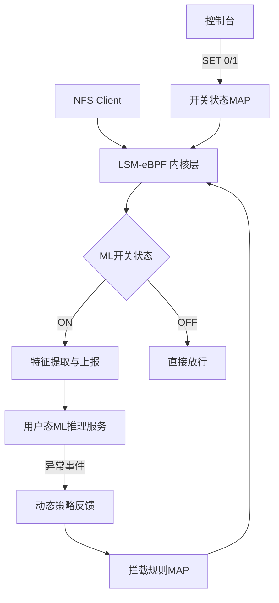

基于您的描述，我将设计一个结合eBPF和机器学习的NFS安全监测系统，采用分层架构实现动态开关ML能力。以下是完整的实现方案：

### 系统架构


### 核心组件实现

#### 1. eBPF 内核程序 (`nfs_monitor.bpf.c`)
```c
#include <linux/bpf.h>
#include <bpf/bpf_helpers.h>
#include <linux/fs.h>
#include <linux/sched.h>
#include <linux/fs_context.h>

// 定义开关状态MAP
struct {
    __uint(type, BPF_MAP_TYPE_ARRAY);
    __uint(max_entries, 1);
    __type(key, u32);
    __type(value, int);
} ml_switch SEC(".maps");

// 定义拦截规则MAP
struct {
    __uint(type, BPF_MAP_TYPE_HASH);
    __uint(max_entries, 1024);
    __type(key, u64); // inode + operation
    __type(value, u8); // 拦截标识
} block_rules SEC(".maps");

// 定义特征上报MAP
struct event {
    u64 inode;
    u32 pid;
    u32 uid;
    u32 op_type; // READ=0, WRITE=1, DELETE=2
    char filename[256];
};

struct {
    __uint(type, BPF_MAP_TYPE_RINGBUF);
    __uint(max_entries, 256 * 1024);
} events SEC(".maps");

// LSM挂载点
SEC("lsm/nfs_file_open")
int BPF_PROG(nfs_file_open, struct file *file) {
    u32 switch_key = 0;
    u64 *block_flag;
    u64 inode_op = (u64)file->f_inode->i_ino << 32 | 0; // OPEN操作
    
    // 检查拦截规则
    block_flag = bpf_map_lookup_elem(&block_rules, &inode_op);
    if (block_flag && *block_flag) {
        bpf_printk("NFS安全拦截: inode %lu", file->f_inode->i_ino);
        return -EPERM;
    }
    
    // 检查ML开关
    int *status = bpf_map_lookup_elem(&ml_switch, &switch_key);
    if (status && *status == 1) {
        struct event *e = bpf_ringbuf_reserve(&events, sizeof(*e), 0);
        if (!e) return 0;
        
        e->inode = file->f_inode->i_ino;
        e->pid = bpf_get_current_pid_tgid() >> 32;
        e->uid = bpf_get_current_uid_gid();
        e->op_type = 0; // OPEN
        
        bpf_probe_read_kernel_str(e->filename, sizeof(e->filename), 
                   file->f_path.dentry->d_name.name);
        
        bpf_ringbuf_submit(e, 0);
    }
    return 0;
}

// 其他操作挂载点(READ/WRITE/DELETE)类似实现...
```

#### 2. 用户态守护进程 (`ml_proxy.c`)
```c
#include <bpf/libbpf.h>
#include "nfs_monitor.skel.h"

struct event {
    u64 inode;
    u32 pid;
    u32 uid;
    u32 op_type;
    char filename[256];
};

// 机器学习模型预测函数(示例)
int ml_predict(struct event *e) {
    // 实际场景替换为真实模型推理
    // 示例逻辑: 检测异常删除操作
    if (e->op_type == 2 /*DELETE*/ && e->uid != 0) {
        return 1; // 异常
    }
    return 0; // 正常
}

int main() {
    struct nfs_monitor_bpf *skel = nfs_monitor_bpf__open_and_load();
    struct ring_buffer *rb = NULL;
    int err;

    // 初始化开关状态为OFF
    u32 key = 0;
    int value = 0;
    bpf_map__update_elem(skel->maps.ml_switch, &key, sizeof(key), 
                        &value, sizeof(value), BPF_ANY);

    // 设置RingBuffer回调
    rb = ring_buffer__new(bpf_map__fd(skel->maps.events), 
                         handle_event, NULL, NULL);
    
    while (true) {
        err = ring_buffer__poll(rb, 100 /*timeout*/);
        if (err < 0) break;
    }
}

// 事件处理回调
static int handle_event(void *ctx, void *data, size_t size) {
    struct event *e = data;
    if (ml_predict(e)) {
        // 生成拦截规则 key=inode+operation
        u64 rule_key = e->inode << 32 | e->op_type;
        u8 block = 1;
        
        // 更新拦截MAP
        bpf_map_update_elem(skel->maps.block_rules, 
                           &rule_key, &block, BPF_ANY);
    }
    return 0;
}
```

#### 3. 动态控制接口 (`nfs_ctl.py`)
```python
#!/usr/bin/env python3
from bcc import BPF
import ctypes as ct

class NFSController:
    def __init__(self):
        self.bpf = BPF(src_file="nfs_monitor.bpf.c")
        self.switch_map = self.bpf["ml_switch"]
        self.block_map = self.bpf["block_rules"]
    
    def set_ml_mode(self, enable: bool):
        key = ct.c_int(0)
        value = ct.c_int(1 if enable else 0)
        self.switch_map[ct.pointer(key)] = ct.pointer(value)
    
    def clear_rules(self):
        keys = []
        for k, _ in self.block_map.items():
            keys.append(k)
        for k in keys:
            del self.block_map[k]

# 使用示例
if __name__ == "__main__":
    ctl = NFSController()
    ctl.set_ml_mode(True)  # 开启ML模式
    # ctl.set_ml_mode(False) # 关闭ML模式
```

### 分层工作流程
1. **基础LSM层**（常驻）：
   - 挂载在NFS文件操作关键点(open/read/write/unlink)
   - 执行基础安全检查（权限验证）
   - 检查拦截规则MAP实时阻断

2. **动态决策层**：
   ```mermaid
   sequenceDiagram
       participant Client
       participant LSM
       participant ML_Switch
       participant ML_Service
       participant Block_MAP
       
       Client->>LSM: NFS操作请求
       LSM->>Block_MAP: 检查拦截规则
       Block_MAP-->>LSM: 拦截/放行
       LSM->>ML_Switch: 查询ML状态
       alt ML模式开启
           LSM->>ML_Service: 发送操作特征
           ML_Service->>ML_Service: 执行模型推理
           ML_Service->>Block_MAP: 更新拦截规则
       else ML模式关闭
           LSM->>Client: 直接放行
       end
   ```

3. **机器学习层**：
   - 接收内核上报的操作特征
   - 使用预训练模型进行实时分析
   - 检测异常模式（高频删除、权限越位等）
   - 动态反馈拦截规则到内核

### 安全增强策略
1. **实时检测能力**：
   - 文件暴力删除检测
   - 权限提升尝试识别
   - 异常访问模式分析
   - 敏感文件操作监控

2. **动态防御机制**：
   ```python
   # 示例动态规则生成
   def generate_rule(event):
       if event.op_type == DELETE and event.uid != ROOT_UID:
           # 非root用户删除操作增加临时拦截
           return {
               "key": f"{event.inode}_{OP_DELETE}",
               "duration": 300  # 拦截5分钟
           }
       # 其他规则...
   ```

3. **零信任策略**：
   - 默认拒绝特权操作
   - 基于行为分析动态授权
   - 敏感操作二次验证

### 部署方式
1. 内核层：
   ```bash
   # 编译加载eBPF程序
   clang -O2 -target bpf -c nfs_monitor.bpf.c -o nfs_monitor.o
   sudo bpftool prog load nfs_monitor.o /sys/fs/bpf/nfs_monitor
   ```

2. 用户层：
   ```bash
   # 启动守护进程
   sudo ./ml_proxy &
   # 控制ML模式
   sudo ./nfs_ctl.py --ml-mode on
   ```

### 性能优化策略
1. **智能采样机制**：
   - 低负载时：全量分析
   - 高负载时：基于熵值采样
   - 突发流量：动态降级到LSM模式

2. **批处理上报**：
   ```c
   // 内核批量上报
   #define BATCH_SIZE 8
   struct batch_event {
       struct event items[BATCH_SIZE];
       u32 count;
   };
   ```

3. **模型轻量化**：
   - 使用ONNX Runtime部署
   - 量化INT8模型
   - 分层推理策略：
     ```mermaid
     graph LR
         A[操作特征] --> B{基础规则引擎}
         B -->|可疑| C[ML全模型]
         B -->|安全| D[放行]
     ```

该系统通过eBPF实现内核级监控，结合用户态ML模型实现智能分析，动态开关机制兼顾性能与安全，为NFS提供实时安全防护。
