### 1. 系统架构

### 2. 工作流程

```mermaid
sequenceDiagram
    participant Client as NFS客户端
    participant Server as NFS服务器
    participant LSM as LSM钩子
    participant eBPF as eBPF程序
    participant Maps as eBPF Maps
    participant Loader as 用户态加载器
    participant ML as ML服务
    participant Console as 控制台
    
    Note over Client,Console: 系统初始化阶段
    Loader->>eBPF: 加载eBPF程序
    Loader->>Maps: 初始化Maps
    Loader->>ML: 启动ML服务
    Loader->>Console: 启动控制台
    
    Note over Client,Console: 运行时监控阶段
    Client->>Server: NFS文件操作请求
    Server->>LSM: 触发LSM安全钩子
    LSM->>eBPF: 调用eBPF程序
    
    alt 安全策略检查
        eBPF->>Maps: 查询安全策略
        eBPF->>Maps: 检查访问权限
        eBPF->>Maps: 验证用户权限
    end
    
    eBPF->>Maps: 记录事件到环形缓冲区
    Maps->>Loader: 事件通知
    
    Loader->>ML: 发送事件数据
    ML->>ML: 特征提取
    ML->>ML: 异常检测
    ML->>ML: 威胁分类
    ML->>Loader: 返回分析结果
    
    alt 检测到威胁
        Loader->>Maps: 更新拦截规则
        Loader->>Console: 威胁告警
        eBPF->>Server: 拒绝访问
    else 正常访问
        eBPF->>Server: 允许访问
        Server->>Client: 返回操作结果
    end
    
    Note over Client,Console: 管理和控制阶段
    Console->>Loader: 用户命令
    Loader->>Maps: 更新配置
    Loader->>ML: 控制ML服务
    Loader->>Console: 返回状态信息
```

### 3. 核心组件详细说明

#### 1. eBPF内核程序 (nfs_monitor.bpf.c)

##### 主要功能：
- **LSM钩子集成**：监控 26 个关键 LSM 安全钩子
- **事件收集**：捕获文件操作、权限检查、扩展属性操作等
- **实时拦截**：基于安全策略实时阻止恶意操作
- **数据结构**：维护多个 eBPF Maps 存储策略和统计信息

##### 核心 Maps：
- **events**: 事件环形缓冲区
- **security_policy_map**: 安全策略配置
- **intercept_rules**: 客户端拦截规则
- **file_whitelist**: 文件访问白名单
- **user_permissions**: 用户权限映射
- **sensitive_xattrs**: 敏感扩展属性
- **access_stats**: 访问统计信息

#### 2. ML模型服务 (ml_service.py)

##### 核心算法：
- **异常检测**：Isolation Forest
- **威胁分类**：Random Forest Classifier
- **行为分析**：Gradient Boosting Classifier
- **模式聚类**：DBSCAN

##### 分析维度：
- **LSM钩子专门化**：针对 26 个 LSM 钩子的特征提取
- **多层检测架构**：规则 + 统计 + 行为 + ML 的复合检测
- **威胁分类系统**：6 大类威胁识别
- **客户端行为档案**：动态风险评级

##### 威胁类别：
1. **PRIVILEGE_ESCALATION** - 权限提升
2. **DATA_EXFILTRATION** - 数据泄露
3. **SYSTEM_MANIPULATION** - 系统操控
4. **MALWARE_EXECUTION** - 恶意软件执行
5. **FILE_DESTRUCTION** - 文件破坏
6. **RECONNAISSANCE** - 侦察活动

#### 3. 用户态加载器 (nfs_monitor_loader.py)

##### 核心功能：
- **eBPF程序管理**：加载、配置、监控 eBPF 程序
- **事件处理**：实时处理内核事件
- **ML服务集成**：协调 ML 分析和决策
- **用户控制台**：提供交互式管理界面

##### 控制台命令：
- **stats**: 查看监控统计
- **clients**: 查看活跃客户端
- **threats**: 查看最近威胁
- **policies**: 管理安全策略
- **ml status**: 查看ML服务状态
- **export**: 导出数据
- **help**: 帮助信息
