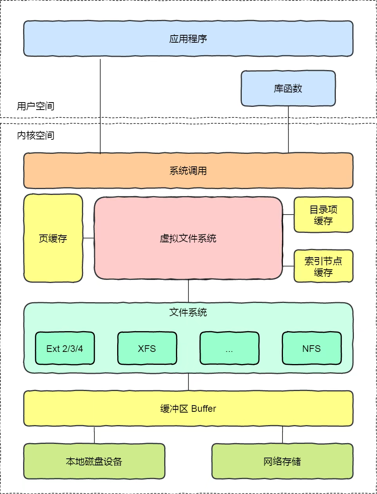

# Linux文件系统详解

## 一、文件系统定义与核心功能
### 1. 定义
文件系统是操作系统用于**组织、存储和管理文件数据**的机制，定义了数据在存储设备（硬盘、SSD等）上的存储与访问方式。

> Linux文件系统层次示意图

 

### 2. 核心功能
| 功能                | 说明                                                                 |
|---------------------|----------------------------------------------------------------------|
| **数据组织**        | 采用树形目录结构，通过路径（如`/home/user/file.txt`）定位文件。       |
| **存储管理**        | 分配磁盘空间，处理碎片化，优化读写效率。                              |
| **权限与安全**      | 控制文件访问权限（如`rwx`），支持加密和日志。                         |
| **元数据管理**      | 记录文件属性（大小、所有者、时间戳等）。                              |
| **错误恢复**        | 通过日志（Journaling）和工具（如`fsck`）保障数据一致性。              |

---

## 二、文件系统类型对比
### 1. 磁盘文件系统
| 类型      | 特点                          | 适用场景                |
|-----------|-------------------------------|-------------------------|
| **ext4**  | 稳定、日志支持、兼容性强       | Linux通用               |
| **XFS**   | 高性能、支持超大文件（EB级）    | 视频编辑/大数据存储      |
| **NTFS**  | 支持权限/加密、大文件          | Windows/Linux双系统     |

### 2. 其他文件系统
- **网络文件系统**：NFS（Linux间共享）、SMB（跨平台共享）。
- **虚拟文件系统**：`/proc`（进程信息）、`tmpfs`（内存临时文件）。
- **特殊用途**：ISO 9660（光盘）、FUSE（用户自定义）。

---

## 三、Linux目录结构（FHS标准）
### 1. 根目录（`/`）核心子目录
| 目录       | 功能说明                                  | 典型内容                     |
|------------|------------------------------------------|------------------------------|
| **/bin**   | 基础用户命令（`ls`, `bash`）              | 所有用户可执行文件            |
| **/etc**   | 全局配置文件（`passwd`, `nginx.conf`）    | 服务配置、系统参数            |
| **/dev**   | 设备文件（`/dev/sda`, `/dev/tty`）        | 硬件抽象为文件                |
| **/proc**  | 虚拟文件系统（实时进程/内核信息）          | `/proc/cpuinfo`              |

### 2. 用户与程序目录
| 目录          | 用途                                                                 |
|---------------|----------------------------------------------------------------------|
| **/home**     | 普通用户家目录（如`/home/alice`），存储个人文件。                    |
| **/usr**      | 用户级软件资源：<br>• `/usr/bin`（应用程序命令如`git`）<br>• `/usr/local`（手动安装软件） |
| **/var**      | 动态数据：日志（`/var/log`）、缓存、邮件队列。                       |

### 3. 系统与临时目录
| 目录       | 功能                                                                 |
|------------|----------------------------------------------------------------------|
| **/boot**  | 启动文件（内核、Grub配置）。                                         |
| **/tmp**   | 临时文件（重启自动清除）。                                           |
| **/mnt**   | 临时挂载点（如U盘、网络共享）。                                      |

---

## 四、Linux独特机制
### 1. 一切皆文件
- 设备、进程、网络套接字均以文件形式存在（如`/dev/sda`、`/proc/pid`）。

### 2. 挂载（Mount）
- 将分区或设备挂载到目录树：  
  ```bash
  mount /dev/sdb1 /mnt/data
  ```

### 3. 链接类型
| 类型       | 特点                              | 示例命令                     |
|------------|-----------------------------------|------------------------------|
| **硬链接** | 共享inode，不可跨文件系统          | `ln file1 file2`             |
| **软链接** | 存储目标路径，可跨文件系统          | `ln -s /path/to/file link`   |

---

## 五、管理与查询命令
```bash
# 查看挂载的文件系统类型
df -Th

# 查看磁盘分区结构
lsblk -f

# 检查ext4文件系统信息（需root）
tune2fs -l /dev/sda1

# 修复文件系统错误
fsck /dev/sda1
```

---

## 六、总结
### 文件系统核心角色
1. **数据组织**：树形结构 + 路径访问。
2. **高效管理**：空间分配、缓存优化（Page Cache）。
3. **安全控制**：权限管理（`chmod`/`chown`）+ 日志恢复。
4. **扩展性**：支持多设备挂载、网络存储。

  
> 更详细的内容请访问[https://segmentfault.com/a/1190000023615225](https://segmentfault.com/a/1190000023615225)
