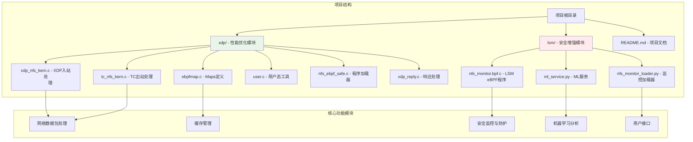

```mermaid
graph TB
    subgraph "项目结构"
        A[项目根目录]
        A --> B[xdp/ - 性能优化模块]
        A --> C[lsm/ - 安全增强模块]
        A --> D[README.md - 项目文档]
        
        B --> B1[xdp_nfs_kern.c - XDP入站处
        理]
        B --> B2[tc_nfs_kern.c - TC出站处理]
        B --> B3[ebpfmap.c - Maps定义]
        B --> B4[user.c - 用户态工具]
        B --> B5[nfs_ebpf_safe.c - 程序加载
        器]
        B --> B6[xdp_reply.c - 响应处理]
        
        C --> C1[nfs_monitor.bpf.c - LSM 
        eBPF程序]
        C --> C2[ml_service.py - ML服务]
        C --> C3[nfs_monitor_loader.py - 监
        控加载器]
    end
    
    subgraph "核心功能模块"
        E[网络数据包处理]
        F[安全监控与防护]
        G[机器学习分析]
        H[缓存管理]
        I[用户接口]
    end
    
    B1 --> E
    B2 --> E
    B3 --> H
    C1 --> F
    C2 --> G
    C3 --> I
    
    style B fill:#e8f5e8
    style C fill:#ffebee
```
